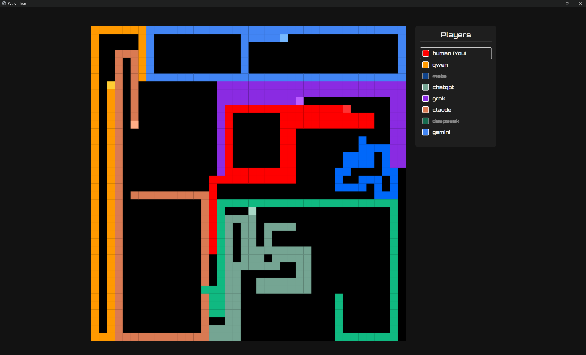

# 🤖 Python Tron 🐍

A classic Tron light-cycle game where you play against a series of AI bots, each with a different personality.



---

## 🎮 How to Play (For Friends)

1.  **[Click here to go to the Downloads page](https://github.com/JamesHandler28/python-tron-game/releases)**
2.  On that page, under "Assets," download the **`main.zip`** file.
3.  **Unzip** the file (Right-click $\rightarrow$ "Extract All...").
4.  Double-click the **`main.exe`** (or `main.app`) file to play!

### ⚠️ IMPORTANT: Security Warning
Your computer will show a security warning. This is normal because I'm not a registered developer.

* **On Windows:** Click "**More info**" $\rightarrow$ "**Run anyway**".
* **On Mac:** **Right-click** the app $\rightarrow$ select "**Open**" $\rightarrow$ confirm you want to open it.

---

## 💻 How to Run (For Developers)

If you want to run the game from the source code:

1.  Clone this repository:
    ```bash
    git clone [https://github.com/JamesHandler28/python-tron-game.git](https://github.com/JamesHandler28/python-tron-game.git)
    cd YourRepoName
    ```

2.  Install the required libraries:
    ```bash
    pip install -r requirements.txt
    ```

3.  Run the game:
    ```bash
    python main.py
    ```